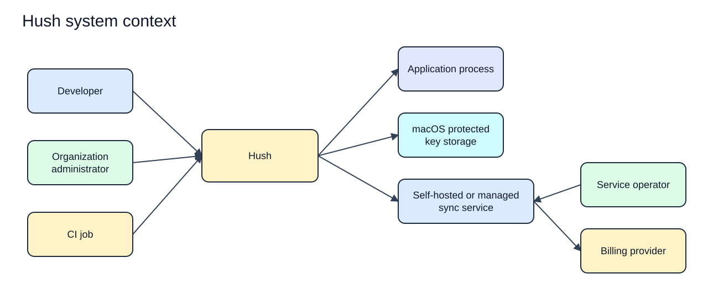
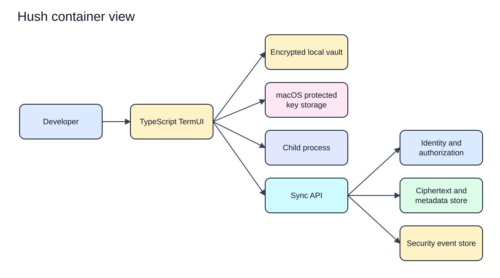
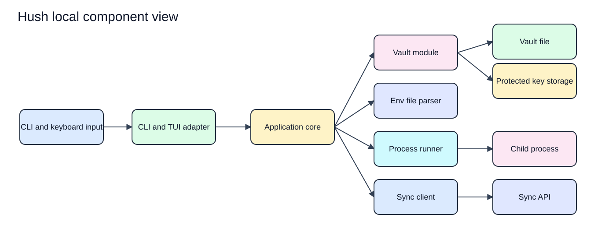
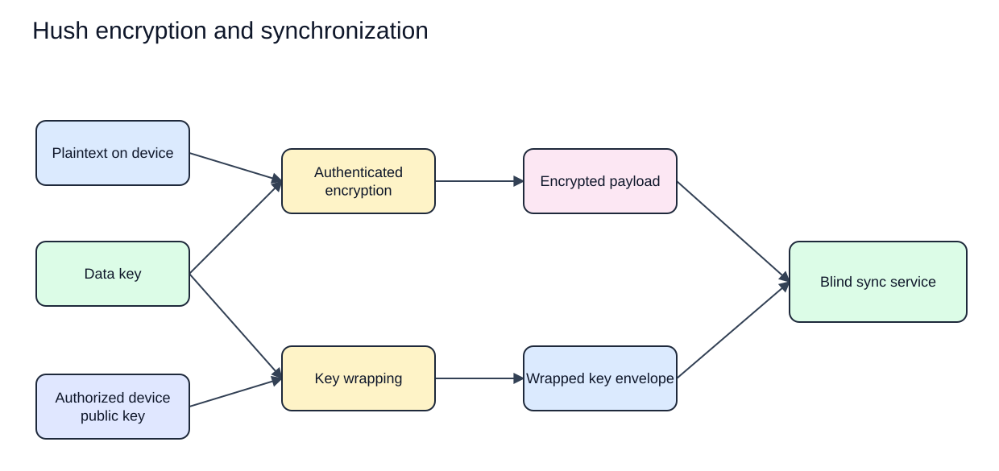
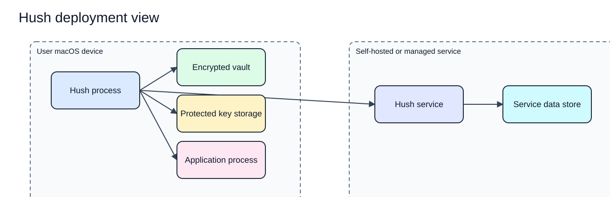

# Hush C4 Diagrams

Status: Proposed  
Last updated: 2026-08-17  
Evidence: [Solution architecture](solution-architecture.md)

These diagrams show intended boundaries. They do not represent implemented components.

Each rendered SVG has an editable Excalidraw source in `docs/assets/diagrams/architecture/`.

## 1. System context

[Edit the system context source](../assets/diagrams/architecture/system-context.excalidraw).

The billing provider is managed-service only. A local-only user does not require the sync service.

## 2. Container view

[Edit the container view source](../assets/diagrams/architecture/container-view.excalidraw).

The sync API can authorize opaque resources and store encrypted envelopes but cannot decrypt secret content.

## 3. Local component view

[Edit the local component view source](../assets/diagrams/architecture/local-component-view.excalidraw).

Module boundaries may remain inside one crate until a second consumer or verified isolation need exists.

## 4. Encryption and synchronization view

[Edit the encryption and synchronization source](../assets/diagrams/architecture/encryption-sync-view.excalidraw).

The exact key hierarchy and algorithms remain unselected pending protocol review.

## 5. Deployment view

[Edit the deployment view source](../assets/diagrams/architecture/deployment-view.excalidraw).

Network transport must provide authenticated confidentiality and integrity even though payloads are independently encrypted.
