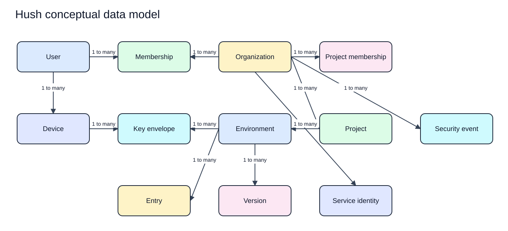

# Hush Conceptual Data Model

Status: Proposed  
Last updated: 2026-08-17  
Evidence: [Product requirements](../product/PRD.md), [terminology](../product/terminology.md), and [ADR-005](../decisions/ADR-005-organization-scoped-collaboration.md)  
Implementation evidence: None

This is a domain model, not a database schema. Storage types, columns, indexes, and database constraints require separate decisions and tests.

The rendered SVG has an editable Excalidraw source in `docs/assets/diagrams/architecture/`.

## 1. Relationship model

[Edit the conceptual data model source](../assets/diagrams/architecture/conceptual-data-model.excalidraw).

## 2. Entity definitions

| Entity | Purpose | Core invariants |
| --- | --- | --- |
| User | Authenticated human identity | Globally stable identity; no secret decryption key held by the service |
| Organization | Tenant, ownership, collaboration, and billing boundary | Owns every collaborative resource |
| Organization membership | User role inside one organization | Unique active user and organization relationship; role is `admin` or `member` |
| Device | Enrolled client identity and public key | Belongs to one user; revocation is monotonic for that device identity |
| Project | Application or service grouping | Belongs to exactly one organization |
| Project membership | Collaborator role inside one project | References an active member of the project's organization; role is `co_owner`, `editor`, or `viewer` |
| Environment | Named configuration context | Belongs to one project and organization |
| Entry | Stable secret identity within an environment | Name and value can be encrypted; identity is opaque to the service |
| Version | Immutable accepted environment change | Has one parent base version except the initial version |
| Key envelope | Encrypted key material for one authorized recipient and scope | Never contains an unwrapped secret key on the service |
| Service identity | Non-human CI or automation identity | Explicit organization, resource, action, and lifetime scope |
| Security event | Administrative or security-relevant metadata | Append-only from the application perspective and contains no secret content |
| Sync cursor | Opaque continuation position | Scoped to organization and client compatibility context |

## 3. Ownership rules

- Organization scope is immutable for a resource in the first design.
- Moving projects or environments between organizations is unsupported until key rotation, history, audit, and authorization migration are designed.
- Users may belong to several organizations.
- Devices belong to users, while project access requires active organization and project membership plus recipient-specific key envelopes for decryption.
- Deleting a user does not silently delete organization-owned resources.
- Removing organization membership disables every project membership in that organization atomically.
- Organization transfer for a project is unsupported initially.

## 4. Local records

The local vault must retain enough authenticated state to work offline and detect unsafe synchronization:

- User and device references, when sync is configured.
- Organization, project, and environment identifiers and decrypted display metadata.
- Encrypted entry values and immutable versions.
- Local pending mutations and their base versions.
- Last validated sync cursor and protocol version.
- Key envelopes and locally protected references needed to decrypt them.
- Tombstones required to prevent deleted records from reappearing.

Plaintext values may be materialized in memory for an explicit action but are not intentionally persisted outside the encrypted vault.

## 5. Service records

The service needs only data required to authenticate, authorize, synchronize, bill, and operate:

- User identifiers, verified identity relationships, and session metadata.
- Organization identifiers, organization memberships, project memberships, roles, and billing entitlements.
- Device identifiers, public keys, state, and revocation timestamps.
- Opaque project, environment, entry, and version identifiers.
- Ciphertext, authenticated envelope metadata, key envelopes, sizes, parent versions, and timestamps.
- Service identity scopes and credential metadata.
- Security events without secret values.
- Idempotency records and synchronization cursors within bounded retention.

Human-readable project, environment, entry, and secret values should be encrypted unless a later accepted requirement proves server visibility necessary.

## 6. Server-visible metadata

An attacker who reads the service store may obtain:

- User and organization relationships.
- Project collaborator and authorization relationships.
- Device public keys and enrollment or revocation times.
- Opaque resource identifiers and version relationships.
- Ciphertext and wrapped keys.
- Record sizes, timestamps, request-related security events, and retention patterns.

The service must not obtain:

- Secret values.
- Human-readable secret names when encrypted metadata is used.
- Environment decryption keys.
- Device private keys.
- Recovery-kit private material.

Traffic and size metadata can still reveal activity patterns. Padding is not required until a measured threat justifies its cost, but this residual risk must remain public.

## 7. Version invariants

- Accepted versions are immutable.
- Every mutation names the base version it observed.
- The service conditionally appends only when the base version is current for that mutation scope.
- Restore creates a new version from an earlier authenticated state; it does not rewrite history.
- Deletion creates a versioned tombstone where synchronization requires it.
- An unsupported or unauthenticated version is never applied locally.
- Ordering is server-coordinated metadata, not proof that plaintext content is valid.

## 8. Lifecycle states

### Device

`pending -> active -> revoked`

A revoked device identity never returns to active. Re-enrollment creates a new device identity and key.

### Membership

`invited -> active -> suspended or removed`

Removed membership does not erase prior audit history. Rejoining creates a new authorization event and may require new key envelopes.

### Local mutation

`pending -> accepted` or `pending -> conflicted -> resolved`

No background path discards a pending mutation without explicit, recoverable handling.

## 9. Required storage constraints

- An organization retains at least one active admin.
- A project references exactly one organization.
- A project membership references an active organization membership from the same organization as the project.
- Project membership is unique for one user and project.
- Authorization derives project organization from the project record rather than request input.

Entry-level versus environment-level version granularity, retention, identifier format, and exact database constraints remain implementation decisions.
