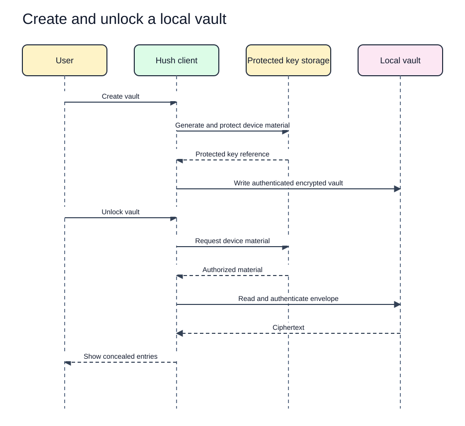
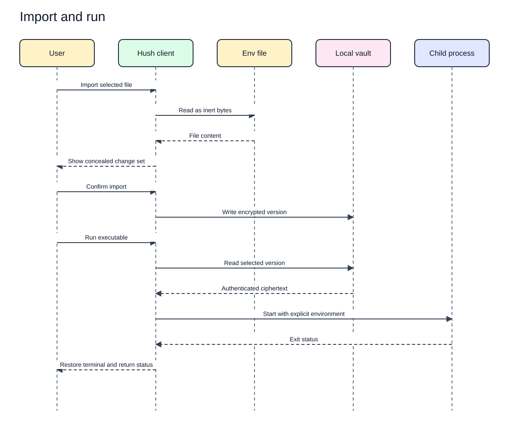
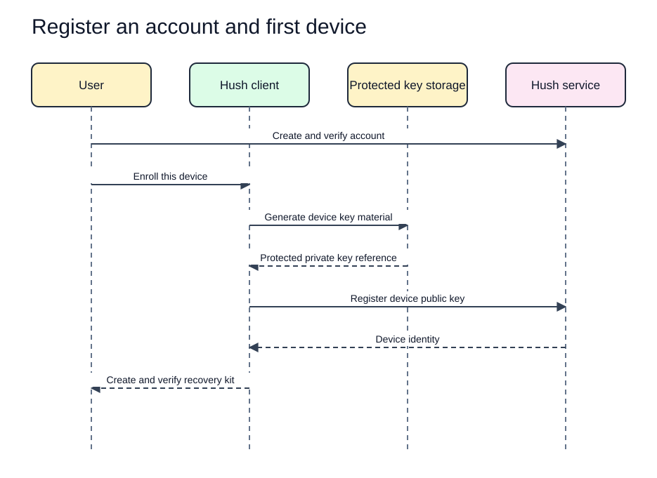
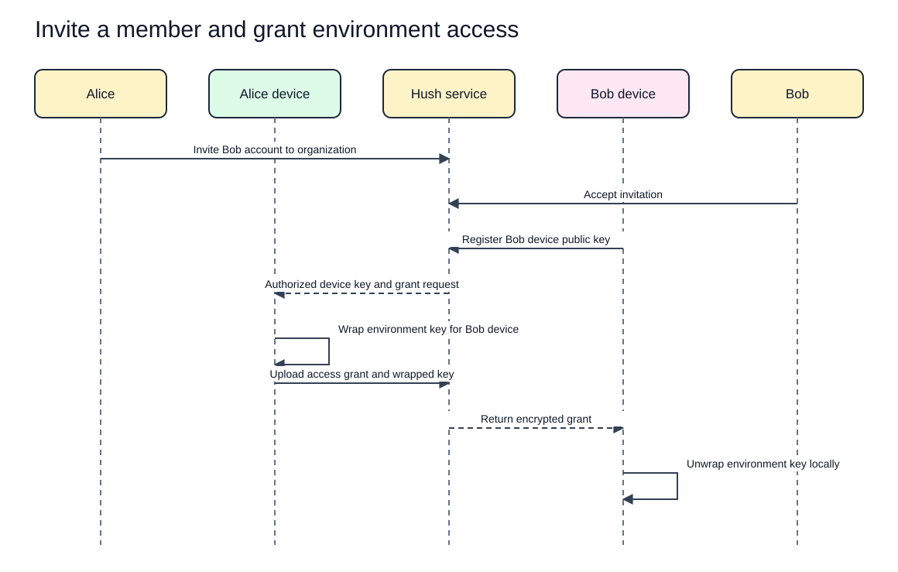
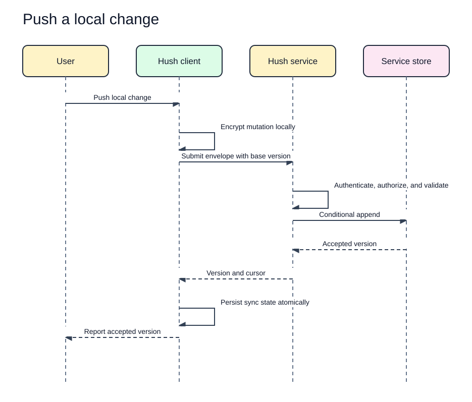
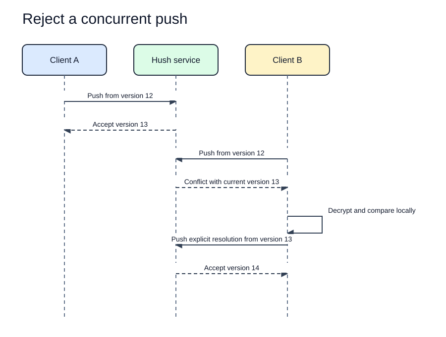
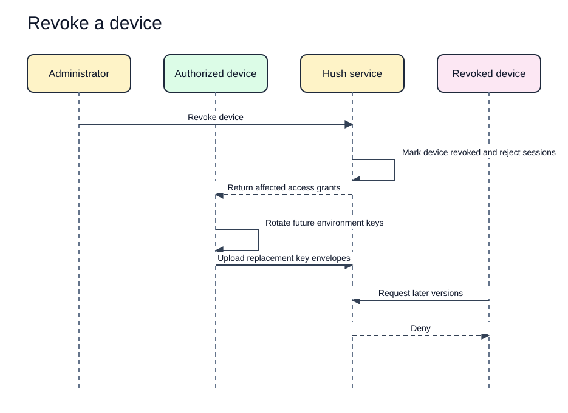
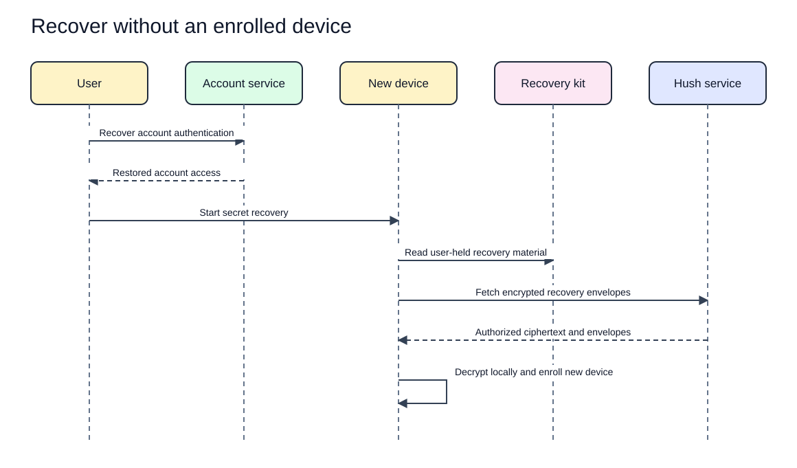

# Hush Sequence Diagrams

Status: Proposed  
Last updated: 2026-08-17  
Evidence: [Solution architecture](solution-architecture.md), [security model](../security/security-model.md), and [ADR-004](../decisions/ADR-004-server-blind-encryption.md)

These sequences define required boundaries. Message names are conceptual, not API operations.

Each rendered SVG has an editable Excalidraw source in `docs/assets/diagrams/architecture/`.

## 1. Create and unlock a local vault

[Edit the create and unlock source](../assets/diagrams/architecture/create-unlock-vault.excalidraw).

No data is returned when envelope authentication fails.

## 2. Import and run

[Edit the import and run source](../assets/diagrams/architecture/import-and-run.excalidraw).

The client does not source the file or evaluate the command through a shell.

## 3. Register an account and first device

[Edit the account registration and device enrollment source](../assets/diagrams/architecture/register-first-device.excalidraw).

The recovery kit is generated client side and is not uploaded in decryptable form.

## 4. Invite a member and grant environment access

[Edit the invitation and grant source](../assets/diagrams/architecture/invite-grant-access.excalidraw).

The exact approver, role, consent, and multi-device behavior remain protocol decisions. The service never receives an unwrapped environment key.

## 5. Push a local change

[Edit the local push source](../assets/diagrams/architecture/push-local-change.excalidraw).

## 6. Reject a concurrent push

[Edit the concurrent push source](../assets/diagrams/architecture/concurrent-push-conflict.excalidraw).

The service does not merge plaintext or silently select a winner.

## 7. Revoke a device

[Edit the device revocation source](../assets/diagrams/architecture/revoke-device.excalidraw).

Revocation cannot erase plaintext or keys already obtained by a previously authorized device. It protects subsequent versions after authorization denial and required rotation.

## 8. Recover without an enrolled device

[Edit the recovery source](../assets/diagrams/architecture/recover-without-device.excalidraw).

Without the recovery kit or an enrolled device, account recovery cannot restore secrets.
