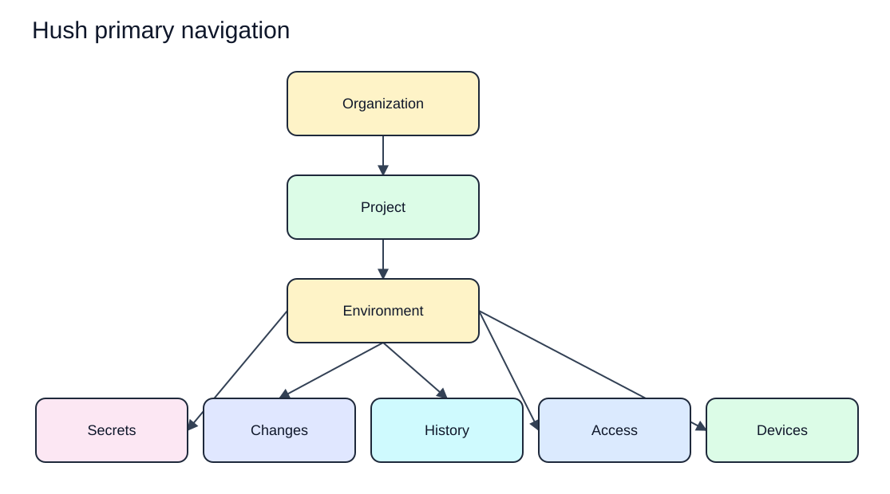
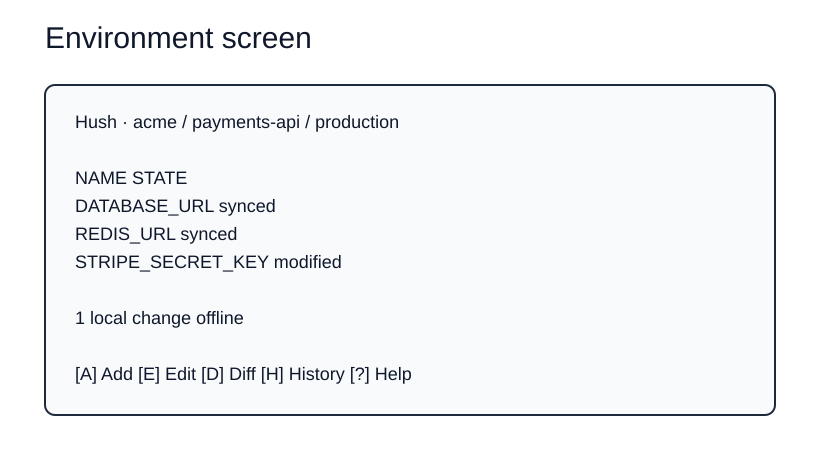
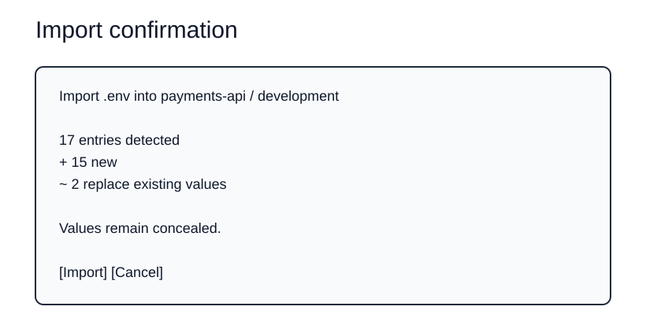
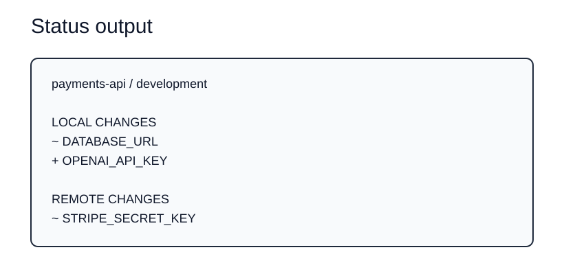
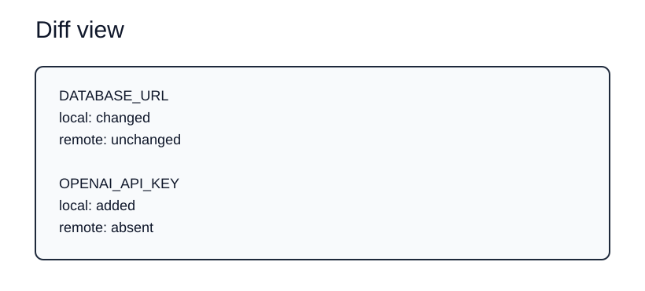
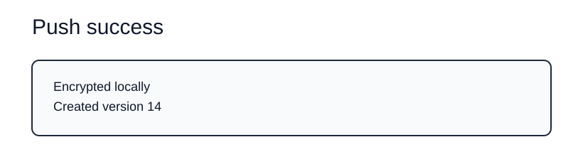
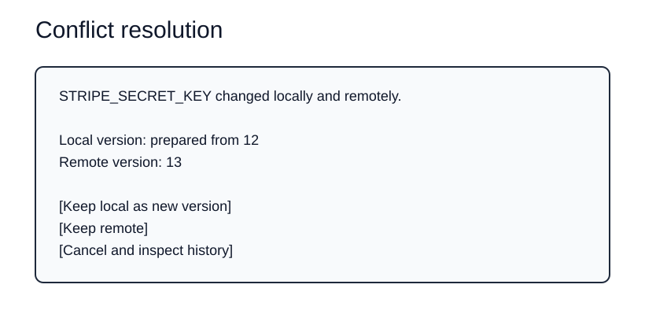
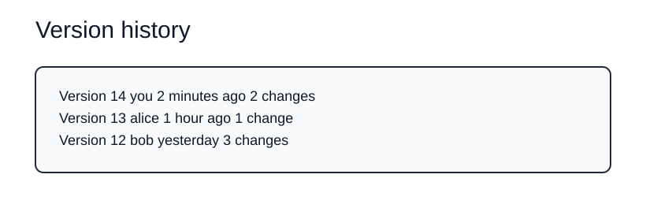
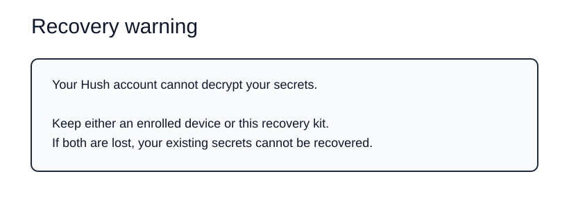

# Hush TUI UX Specification

Status: Proposed  
Last updated: 2026-08-17  
Audience: Product, design, security, and engineering contributors  
Evidence: [Product requirements](../product/PRD.md), [terminology](../product/terminology.md), and [security model](../security/security-model.md)  
Implementation evidence: None

Each rendered SVG has an editable Excalidraw source in `docs/assets/diagrams/design/`.

## 1. Product experience

Hush should feel like a fast local developer tool, not an administration console. The user works with one organization, project, and environment context at a time. Values are concealed unless an explicit action requires plaintext.

The TUI complements scriptable CLI commands. A user can inspect and resolve state in the TUI, while automation uses non-interactive commands with stable output and exit behavior after those contracts are designed.

## 2. Experience principles

1. Show context before actions: organization, project, environment, local state, and sync state remain visible.
2. Show secret names and change types before values.
3. Require deliberate actions for reveal, copy, export, destructive reset, sharing, and permission changes.
4. Never use color as the only state indicator.
5. Keep local work available when offline.
6. Explain conflicts and recovery in product language, not protocol language.
7. Restore the terminal after every exit path.
8. Keep common actions discoverable through visible key hints.

## 3. TermUI implementation

The application uses TermUI core, widgets, UI primitives, and JSX for rendering. `@termuijs/store` owns global and explicitly persisted non-secret UI state. `@termuijs/tss` defines reusable theme tokens, `@termuijs/router` provides screen navigation, and `@termuijs/motion` provides optional transitions.

Respect `NO_COLOR`, `NO_MOTION`, terminal color capability, and Unicode capability. Motion cannot be required to understand a state change. Use `@termuijs/testing` for renderer, keyboard, resize, accessibility-query, and virtual-motion-clock tests. Run the source directly with `tsx` during interactive development because watch wrappers do not preserve Hush terminal input.

`@termuijs/data` may provide non-secret CPU, memory, disk, network, process, and HTTP health displays where a real screen requires them. It does not receive Hush database credentials or secret values.

## 4. Primary navigation



[Edit the primary navigation source](../assets/diagrams/design/primary-navigation.excalidraw).

The first local alpha includes Secrets, Changes, and History. Access and Devices enter with team synchronization.

Global actions:

| Key | Action | Notes |
| --- | --- | --- |
| `?` | Open contextual help | Shows only actions available in the current view |
| `/` | Filter current list | Filters names and metadata, never values |
| `Esc` | Close modal or return | Does not discard edits without confirmation |
| `q` | Quit | Confirms when pending edits or operations exist |
| `Ctrl+C` | Cancel current operation or exit | Restores terminal state |

View-specific keys must be displayed in the footer. Final bindings require usability testing and must avoid conflicts with terminal conventions.

## 5. Environment screen



[Edit the environment screen source](../assets/diagrams/design/environment-screen.excalidraw).

Requirements:

- The breadcrumb always identifies current organization, project, and environment.
- Secret values are absent from the list.
- State uses a word plus optional styling.
- Offline, locked, syncing, conflicted, revoked, and incompatible states are visually distinct and announced in text.
- The footer contains available actions, not every application shortcut.

## 6. Local setup workflow

### First launch

1. Explain local-only use and optional future account synchronization.
2. Explain that secret recovery requires a verified recovery path once synchronization is enabled.
3. Create or open the local vault through the accepted macOS protected-storage flow.
4. Create a single-member organization workspace, project, and environment.
5. Land on the empty environment screen with Import and Add actions.

Do not require an account for local-only alpha use.

### Import `.env`

Proposed CLI entry:

```bash
hush import .env
```

TUI confirmation:



[Edit the import confirmation source](../assets/diagrams/design/import-confirmation.excalidraw).

The parser reports unsupported syntax by line and never executes the file. Replacement requires explicit confirmation. The source file remains unchanged.

### Run an application

Proposed CLI entry:

```bash
hush run -- npm run dev
```

The first `--` ends Hush options. Arguments after it are passed directly to the executable without shell interpretation.

Before launch, Hush reports organization, project, environment, secret count, and unresolved conflict or lock state without printing values. The child exit status becomes the Hush exit status unless Hush itself fails earlier.

## 7. Inspect changes

Proposed status output:



[Edit the status output source](../assets/diagrams/design/status-output.excalidraw).

Proposed diff view:



[Edit the diff view source](../assets/diagrams/design/diff-view.excalidraw).

Diff shows presence, change type, version, author, and time where authorized. It does not show old or new values by default. Revealing a value requires a separate action and does not reveal an entire environment at once.

## 8. Push and pull

### Push

1. Show local change types and current base version.
2. Block when the client knows it is stale or the environment is conflicted.
3. Encrypt locally.
4. Submit the mutation and show pending state until acceptance is confirmed.
5. Report the accepted version without claiming success after a timeout.

Proposed success output:



[Edit the push success source](../assets/diagrams/design/push-success.excalidraw).

### Pull

1. Authenticate and validate organization and device state.
2. Download encrypted changes.
3. Authenticate envelopes before changing local state.
4. Preserve pending local changes.
5. Surface conflict instead of overwriting.

### Conflict



[Edit the conflict resolution source](../assets/diagrams/design/conflict-resolution.excalidraw).

The service never resolves secret plaintext. Choosing local creates a new version based on the current remote version. Choosing remote preserves the discarded local mutation in recoverable history until the retention policy is defined.

## 9. Add, edit, reveal, and copy

- Add and edit use a masked input that supports paste without echo.
- Hush never validates a secret by sending it to an external service unless a future integration explicitly requests and documents that action.
- Reveal shows one value for a bounded period and has an immediate hide action.
- Copy requires a deliberate action and displays a clipboard limitation notice on first use.
- Timed clearing is best effort and does not claim removal from clipboard managers.
- Closing the modal conceals the value and clears local view state where possible.

## 10. History and restore



[Edit the version history source](../assets/diagrams/design/version-history.excalidraw).

History lists versions and change metadata without values. Restoring version 12 creates a new version based on current state. It does not delete or rewrite versions 13 and 14.

Restore confirmation shows affected entry names and change types. It blocks while required history keys are unavailable or current state is incompatible.

## 11. Users, devices, and recovery

### User connection

Signing in enables organization collaboration and synchronization. It does not upload plaintext or transfer decryption authority to the service.

### Recovery setup

Before synchronized secrets rely on recovery, Hush requires the user to verify the recovery kit through a safe challenge. The UI states:



[Edit the recovery warning source](../assets/diagrams/design/recovery-warning.excalidraw).

### Device enrollment

The new device screen shows a short request identifier. An enrolled device or recovery flow verifies and approves it. User login alone leaves the new device unable to decrypt secrets.

### Final-device removal

Removing the final enrolled device is blocked until a verified recovery kit exists or the user completes a typed confirmation acknowledging permanent loss risk.

## 12. Sharing and permissions

The access screen shows organization membership, project collaborator role, and granted project scope. It never implies that organization administration automatically grants plaintext access.

Organization roles are `admin` and `member`. Project roles are `co_owner`, `editor`, and `viewer`. The interface permits project assignment only for active members of the owning organization. Admins manage organization users and all projects. Co-owners manage project configuration and collaborators. Editors change project environments and secrets. Viewers have read-only use and disclosure access.

An invitation is incomplete until:

1. The user accepts organization membership.
2. A device is enrolled.
3. An authorized device verifies recipient authority.
4. Required environment keys are wrapped for the recipient device.

Removing access shows that future access will be denied and affected keys rotated, while previously copied data cannot be erased from the removed device.

## 13. Error states

Every error includes what failed, whether local data changed, and the safe next action.

| Condition | Required message behavior |
| --- | --- |
| Wrong unlock or tampered vault | Do not distinguish details that weaken offline protection; state that no data changed |
| Unsupported `.env` syntax | Show line and syntax category without printing the value |
| Network timeout during push | State that acceptance is unknown and Hush will check the mutation ID |
| Conflict | Preserve local change and open resolution path |
| Revoked device | Stop sync, retain encrypted local data, and offer authorized recovery or sign-out |
| Unsupported version | Refuse mutation and provide upgrade guidance |
| Child failure | Return its exit status and confirm terminal restoration only when observed |
| Unrecoverable secrets | State that account reset cannot restore them and separate destructive reset |

## 14. Accessibility

- All actions work without a mouse.
- Focus and selection have text or shape cues in addition to color.
- Information remains understandable with color disabled.
- Help and errors use plain language and consistent terminology.
- Narrow terminals receive a usable reduced layout or a clear minimum-size message.
- Animation is optional and never required to perceive state.
- Screen-reader behavior in supported macOS terminals requires observed testing before claims are made.
- Keyboard shortcuts are remappable only if testing shows a need. Do not add configuration preemptively.

## 15. UX validation

Observe target users complete these tasks without coaching:

1. Create a project and import `.env`.
2. Find which entries changed without revealing values.
3. Run an application and interpret a child failure.
4. Restore an earlier version.
5. Understand offline and conflict state.
6. Enroll a second device.
7. Explain the difference between account recovery and secret recovery.
8. Remove a device and describe what remains accessible.

Record completion, errors, unsafe assumptions, and terminology confusion. Do not treat opinions alone as usability evidence.

## 16. Unresolved decisions

1. Final key bindings after usability testing.
2. Minimum terminal dimensions after responsive-layout tests.
3. Exact local unlock interaction after protected-storage testing.
4. Conflict metadata and resolution retention.
5. Human verification for device and recipient public keys.
6. Stable non-interactive output and exit-code contract.
