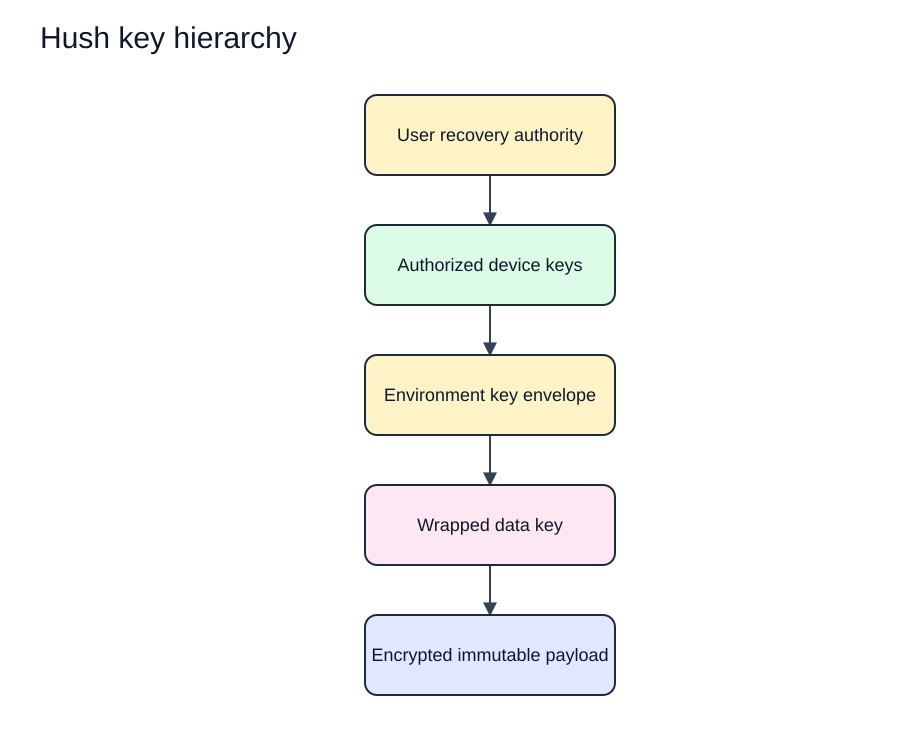

# Hush Key Management

Status: Proposed  
Last updated: 2026-08-17  
Evidence: [Cryptographic protocol](cryptographic-protocol.md) and [ADR-004](../decisions/ADR-004-server-blind-encryption.md)  
Implementation evidence: None

The rendered SVG has an editable Excalidraw source in `docs/assets/diagrams/security/`.

## 1. Ownership model

- Users control device private keys and recovery material.
- Authorized devices create environment and data keys.
- Services hold public keys, wrapped keys, ciphertext, identifiers, and state needed for synchronization.
- Organization administrators control authorization policy but do not automatically receive plaintext or user private keys.
- Managed-service operators cannot decrypt secrets.

## 2. Key hierarchy

[Edit the key hierarchy source](../assets/diagrams/security/key-hierarchy.excalidraw).

The arrows mean authorization or wrapping relationships, not direct key derivation. Independent randomly generated keys are preferred unless the accepted protocol proves a derivation hierarchy safe and necessary.

## 3. Lifecycle table

| Key type | Create | Use | Rotate | Revoke or destroy |
| --- | --- | --- | --- | --- |
| Device identity | On device enrollment | Device approval, grant, unwrap, or authentication according to suite | New device identity rather than in-place reuse after compromise | Mark device revoked server side; remove local protected material when available |
| Recovery authority | During verified recovery-kit setup | Approve a new device and unwrap authorized recovery envelopes | Replace only through an enrolled authorized device, then reissue affected envelopes | Destructive reset when no valid copy remains |
| Environment key | On environment creation or rotation | Wrap payload data keys | Membership or device revocation, exposure, suite migration, or policy change | Retain only as long as authorized history requires |
| Data key | Per immutable payload or bounded record set | Encrypt and decrypt one defined scope | Never reuse for a new scope | Discard plaintext key after wrapping and use |
| Session credential | During service authentication | Authorize bounded network operations | Renew under authentication policy | Expire, revoke, and delete locally on sign-out or compromise |

## 4. Device storage

The proposed macOS binding is `@napi-rs/keyring`. It must not be used for user secrets until Phase 2 verifies installation, persistence, denial, deletion, and fail-closed behavior on every supported macOS target. TermUI `useKeychain` is excluded because its current dependency is archived and its fallback behavior does not meet this boundary.

The accepted implementation must:

- Prevent tracked files or ordinary application configuration from containing private keys.
- Use macOS access controls appropriate to the supported threat model.
- Use ordinary logged-in user protection for the local alpha. Do not add a separate Hush passphrase unless recovery requirements justify it.
- Report unavailable or denied protected storage without falling back to plaintext.
- Support backup and migration only when the security promise remains true.
- Document which same-user or privileged local processes can still access material.

## 5. Recovery storage

The recovery kit is user held and must be usable without Hush service custody. Product guidance must offer at least one offline storage method and explain that anyone with the kit plus required account access may gain secret access according to the protocol.

Hush must verify the kit during creation. A displayed kit that the user never verifies is not evidence of recoverability.

The service may store public recovery verification material and encrypted recovery envelopes. It must not store material that lets it reconstruct the recovery secret.

## 6. Grants and envelopes

- Every environment key envelope targets one explicit device or recovery recipient.
- The envelope binds organization, environment, recipient, granting authority, key epoch, and protocol suite.
- Creation occurs only on an authorized device.
- The service validates organization authorization but cannot change the recipient without client detection.
- Clients reject duplicate or conflicting current envelopes unless the protocol defines an authenticated replacement.

## 7. Rotation

Rotation is a state transition, not an in-place overwrite:

1. Confirm current organization authorization and active device state.
2. Generate a fresh environment key and increment the key epoch.
3. Create envelopes for all remaining authorized recipients.
4. Encrypt later payloads under data keys wrapped by the new epoch.
5. Publish the new epoch and envelopes atomically or through a resumable protocol.
6. Verify at least one authorized recovery path before declaring completion.
7. Retain old keys only while authorized history requires them.

Partial rotation must be detectable and resumable. The service must not claim revocation complete while later versions can still be encrypted for a revoked recipient.

## 8. Membership and device changes

- Adding a member does not give access until an authorized device creates the required key envelopes.
- Removing a member denies service access immediately and rotates affected environment keys for future versions.
- Revoking one device does not revoke the account's other devices.
- Revoking the final device requires verified recovery availability or an explicit warning that secret access may be lost.
- Rejoining an organization does not restore prior key grants automatically.

## 9. Backup and restore

- Local backups contain only encrypted vault data and wrapped material.
- Service backups contain ciphertext, public keys, envelopes, metadata, and security events.
- A restore does not bypass current device, membership, revocation, or protocol checks.
- Recovery drills use documented key inputs and verify actual decryption on an authorized device.
- Backup retention and key retention must be designed together.

## 10. Compromise response

| Compromise | Required response |
| --- | --- |
| Account credential | Revoke sessions, verify device list, preserve separation from secret recovery, review membership events |
| Device private key | Revoke device, rotate affected environment keys, reissue envelopes, notify affected organizations |
| Recovery kit | Replace recovery authority from an enrolled device, rotate affected envelopes, record a security event |
| Environment key | Rotate the environment key and assess all versions encrypted under that epoch |
| Service data store | Preserve evidence, rotate service credentials, validate client rollback state, disclose metadata impact; secret plaintext should remain protected |
| Release signing key | Stop distribution, revoke or replace trust material, publish verified recovery instructions, investigate client compromise |

## 11. Verification

- Inventory every key role and forbid unclassified key material.
- Test key generation failure and random-source failure behavior.
- Test envelope recipient, scope, epoch, and version binding.
- Test partial rotation, crash recovery, duplicate delivery, and rollback.
- Test revocation with offline and malicious stale clients.
- Test recovery from documented materials on a clean macOS device.
- Verify logs, crash reports, memory diagnostics, and test fixtures contain no real keys.
