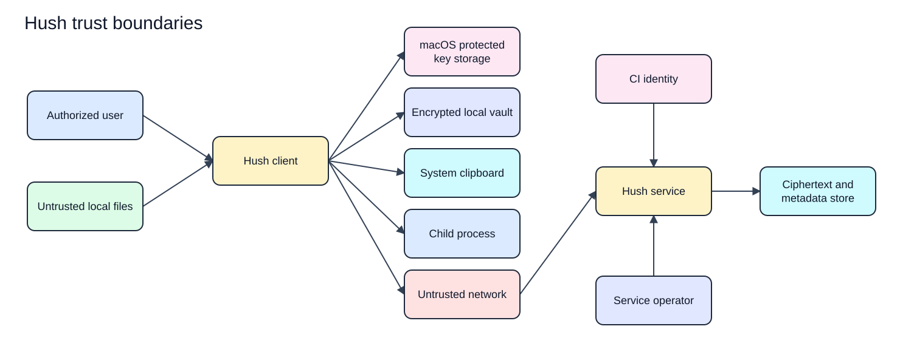

# Hush Security Model

Status: Proposed  
Last updated: 2026-08-17  
Evidence: [Product requirements](../product/PRD.md), [solution architecture](../architecture/solution-architecture.md), and [ADR-004](../decisions/ADR-004-server-blind-encryption.md)  
Implementation evidence: None

The rendered SVG has an editable Excalidraw source in `docs/assets/diagrams/security/`.

## 1. Security promise

Hush encrypts secret values on authorized devices before synchronization. The Hush service stores ciphertext, wrapped keys, and required metadata but cannot decrypt secret values. Device private keys and usable recovery material remain under user control.

This promise does not protect plaintext after an authorized user reveals, copies, exports, or injects it into another process. It also cannot protect a user from an attacker with control of the authorized operating-system session while Hush uses plaintext.

## 2. Objectives

In priority order:

1. Prevent unauthorized disclosure of secret values, device private keys, and recovery material.
2. Prevent unauthorized or undetected changes to secrets, key grants, memberships, versions, and security events.
3. Prevent silent data loss during local writes, synchronization, migration, rotation, recovery, and restore.
4. Keep local workflows available during expected service or network failure.
5. Minimize observable metadata and document what remains visible.

## 3. Trust boundaries

[Edit the trust boundaries source](../assets/diagrams/security/trust-boundaries.excalidraw).

Every boundary requires authentication or explicit user intent, input validation, bounded resources, safe errors, and cleanup appropriate to the data crossing it.

## 4. Sensitive assets

| Asset | Objective |
| --- | --- |
| Secret values and history | Confidentiality, integrity, recoverability |
| Device and recovery private material | Confidentiality, integrity, controlled lifecycle |
| Environment and data keys | Confidentiality, correct scope, rotation |
| Account sessions and service credentials | Confidentiality, replay resistance, bounded lifetime |
| Organization memberships, project memberships, roles, and grants | Integrity, tenant isolation, auditability |
| Versions, cursors, and tombstones | Integrity, freshness, conflict detection |
| Local vault, service data, and backups | Confidentiality, integrity, compatibility |
| Security event history | Integrity, ordering, useful retention without secret content |
| Release artifacts and update metadata | Authenticity, integrity, rollback safety |
| Billing state | Integrity and privacy, separated from resource authorization |

## 5. Local controls

### Input and import

- Read only user-selected files.
- Parse `.env` content as inert data and never source or evaluate it.
- Bound file size, line length, entry count, key length, and value length.
- Reject malformed and ambiguous input with safe, line-specific errors.
- Do not log source content or fragments that may contain values.

### Local storage

- Authenticate the vault header and encrypted records before decoding.
- Bind format version and security-relevant routing metadata to authentication.
- Write atomically and retain the prior verified copy until the replacement is verified.
- Create sensitive files with restrictive permissions from their first write where macOS supports it.
- Reject unsupported formats without mutation.
- Never build custom cryptographic primitives.

### Terminal and process execution

- Conceal values by default.
- Start child processes directly with an explicit environment.
- Do not place secrets in command-line arguments.
- Restore terminal state after normal exit, error, cancellation, signal, or panic where possible.
- Propagate child exit status and signals predictably.
- Clear temporary buffers where libraries permit it and document unavoidable copies.

### Clipboard and export

- Require an explicit action to copy or export.
- Confirm before overwriting an existing export.
- Warn that exported files and clipboard data leave the encrypted Hush boundary.
- Never promise universal clipboard clearing across clipboard managers.
- Clear a timed clipboard value only if the clipboard still contains the value Hush placed there.

## 6. Service controls

### Authentication and device enrollment

- Authenticate accounts server side for every request.
- Treat account authentication and device decryption authority as separate capabilities.
- Require an existing enrolled device or valid user-held recovery authority to approve a new decrypting device.
- Prevent the service from substituting an attacker public key during enrollment or sharing.
- Use short-lived sessions with bounded renewal after an authentication design is selected.
- Require recent authentication for membership, device, recovery, role, and destructive organization actions.

### Authorization and tenant isolation

- Resolve organization membership and permissions from server-owned state.
- Require `admin` for organization configuration, invitations, user removal, organization-role changes, permanent project deletion, and any project administration performed at organization scope.
- Require `co_owner` or organization `admin` for project configuration, collaborator assignment, and project-role changes.
- Permit `editor` to read and mutate project environments and secrets without managing configuration or collaborators.
- Permit `viewer` to read, reveal, copy, export, and run with project secrets, but deny every mutation.
- Require the collaborator to have an active membership in the project's organization.
- Keep decryption authority separate from administrative authority. An organization admin without a project key envelope cannot decrypt project secrets.
- Deny when scope or policy is missing or ambiguous.
- Apply organization scope to reads, writes, constraints, caches, jobs, exports, backups, logs, metrics, and operator tools.
- Treat opaque resource identifiers as references, never authorization proof.
- Keep payment-provider identifiers and billing state separate from resource authorization.
- Scope CI identities to explicit organization, project, environment, actions, and lifetime.

### Synchronization

- Protect network transport even though payloads are independently encrypted.
- Validate schema, size, version, authorization, base version, idempotency, and active device state.
- Authenticate routing metadata with the encrypted payload so the service cannot undetectably move ciphertext between scopes.
- Reject silent merge, stale mutation, replay with changed content, and incompatible clients.
- Preserve local pending work on timeout or conflict.

### Operational access

- Keep operator access least privileged, time bounded, approved, and audited.
- Do not build support tooling that bypasses decryption boundaries.
- Redact credentials and encrypted payloads from operational tooling unless the payload is strictly necessary for a controlled incident investigation.
- Test backup restoration without introducing a service-side decryption key.

## 7. Metadata exposure

The service can observe user and organization relationships, organization and project memberships, roles, device public keys and state, opaque resource identifiers, ciphertext and wrapped-key sizes, version relationships, timestamps, request timing, network metadata, and security events.

Human-readable project names, environment names, entry names, secret values, version content, device private keys, environment keys, and recovery private material should remain encrypted or local.

Encryption does not hide traffic volume, record sizes, access timing, membership relationships, or device activity. Padding and traffic-shaping are not initial requirements, but the residual risk must remain documented.

## 8. Logging, diagnostics, and telemetry

Allowed fields require a reviewed schema. Candidate fields are operation name, outcome category, duration, opaque correlation identifier, client version, protocol version, and non-sensitive opaque resource identifiers.

Never collect secret names when they may be sensitive, secret values, decrypted payloads, unlock material, recovery material, session credentials, service credentials, raw imported files, child-process environments, or raw payment-provider payloads.

Client telemetry is opt-in. Managed-service operational telemetry is minimized, documented, access controlled, and retained for a defined period.

## 9. Recovery and deletion

- Account recovery restores authentication and organization membership subject to organization policy.
- Secret recovery requires an enrolled device or user-held recovery kit.
- If all enrolled devices and recovery material are lost, secret values are unrecoverable.
- Destructive reset creates new key material and cannot restore prior ciphertext.
- Deletion policies distinguish active data, version history, local vaults, service records, backups, billing records, and security events.
- Hush does not claim immediate physical or cryptographic deletion until key and backup behavior prove it.

See [account recovery](account-recovery.md) and [key management](key-management.md).

## 10. Security verification

### Local alpha

- Prove imported content is never executed.
- Verify overwrite protection, permissions, atomic writes, corruption rejection, and migration behavior on supported macOS versions.
- Verify direct child execution, cancellation, signal handling, cleanup, exit propagation, and terminal restoration.
- Test redaction across logs, errors, panic paths, and diagnostics.
- Run cryptographic test vectors for valid, tampered, truncated, wrong-key, incompatible-version, and migrated data.

### Team beta

- Test missing, expired, revoked, replayed, substituted, and cross-organization identities and keys.
- Test duplicate, reordered, stale, conflicting, incompatible, and partially persisted sync messages.
- Prove a revoked device cannot fetch or publish later versions.
- Exercise user-held recovery and unrecoverable-loss paths.
- Obtain independent threat-model and cryptographic-protocol review.

### Managed service

- Exercise every resource and asynchronous path for cross-organization access.
- Review network, identity, data, backup, operator, billing, and support boundaries in the deployed configuration.
- Run incident response and restoration exercises.
- Enforce dependency, source, build, artifact, and release integrity checks.

## 11. Release blockers

- No accepted threat model for the milestone.
- No reviewed cryptographic protocol before storing user secrets.
- Account authentication can add a decrypting device without device or recovery approval.
- Logs, diagnostics, telemetry, or support tooling can contain secret values or usable keys.
- Authorization depends on client-provided tenant or role claims.
- Storage migration can overwrite the only verified copy.
- Revocation and key rotation for future versions are undefined.
- Supported macOS permission, process, key-storage, or terminal behavior is untested.
- Release artifacts lack an authenticated distribution and rollback policy.

## 12. Remaining decisions

1. Minimum supported macOS version and protected key-storage mechanism.
2. Cryptographic library, algorithms, parameters, and independent review process.
3. Authentication provider, session model, and recent-authentication rules.
4. Environment-level key-envelope and access-grant semantics within an authorized project.
5. Key rotation treatment of history.
6. Self-hosted organization count and operator-access model.
7. Metadata retention, security-event retention, and deletion schedule.
