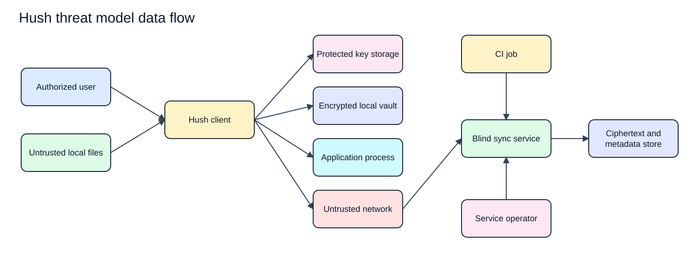

# Hush Threat Model

Status: Proposed  
Last updated: 2026-08-17  
Scope: Pre-implementation product, architecture, security, and engineering specifications  
Implementation evidence: None

The rendered SVG has an editable Excalidraw source in `docs/assets/diagrams/security/`.

## Executive summary

Hush's highest risks are compromise of an authorized endpoint or release artifact, cross-organization authorization failure, attacker-controlled device enrollment, and errors in the future cryptographic and synchronization protocols. Server-blind encryption reduces the confidentiality impact of service data-store compromise, but it does not prevent metadata disclosure, deletion, rollback, authorization abuse, or traffic analysis. Every control referenced here is proposed until source, test, and runtime evidence exists.

## Scope and assumptions

In scope:

- The macOS local client described in [solution architecture](../architecture/solution-architecture.md).
- Local `.env` import, encrypted storage, TUI display, clipboard, export, and child-process execution.
- User authentication, organizations, project collaboration, device enrollment, sharing, synchronization, and recovery.
- Self-hosted and managed sync services, service storage, operators, backups, CI identities, and release artifacts.
- The design documents under `docs/`.

Out of scope:

- Code vulnerabilities, because no application code exists.
- Specific cloud, database, framework, identity-provider, billing-provider, and cryptographic-library configurations, because none are selected.
- Protection from an attacker with full control of an authorized endpoint while plaintext is in use.
- Enterprise identity provisioning, mobile clients, browser clients, and web dashboards.

Confirmed assumptions:

- The service cannot decrypt secret values or user recovery material ([ADR-004](../decisions/ADR-004-server-blind-encryption.md)).
- Organization is the top-level collaboration and tenant boundary ([ADR-005](../decisions/ADR-005-organization-scoped-collaboration.md)).
- The local alpha targets macOS first ([ADR-006](../decisions/ADR-006-macos-first-local-alpha.md)).
- Account recovery alone cannot recover secrets. An enrolled device or user-held recovery kit is required ([account recovery](account-recovery.md)).
- The managed service is multi-tenant. The number of organizations supported by one self-hosted deployment remains unconfirmed.

Open questions that may change risk:

- Which authentication and session protocols will be used?
- How are recipient public keys verified without trusting the service on first contact?
- Which cryptographic library, suite, serialization, and rollback-checkpoint design will be selected?
- Do key rotations protect only future versions or re-encrypt history?
- What macOS versions, key-storage controls, terminal environments, and release channels are supported?

## System model

### Primary components

- **Hush client:** TypeScript TermUI application that parses input, renders state, coordinates local use cases, encrypts and decrypts data, synchronizes ciphertext, and runs child processes ([solution architecture](../architecture/solution-architecture.md)).
- **Protected key storage:** Unselected macOS facility intended to protect device private material ([key management](key-management.md)).
- **Local vault:** Versioned encrypted local state with atomic update and corruption rejection requirements ([security model](security-model.md)).
- **Sync service:** Authenticates accounts, enforces organization access, validates protocol metadata, and stores ciphertext without secret decryption keys ([sync protocol](../architecture/sync-protocol.md)).
- **Service store:** Persists identity, authorization, device, opaque resource, version, ciphertext, wrapped-key, idempotency, and security-event records ([data model](../architecture/data-model.md)).
- **Application process:** Receives selected plaintext values through its process environment after explicit user action ([solution architecture](../architecture/solution-architecture.md)).
- **CI job:** Uses a future non-human identity scoped to an organization resource and lifetime ([security model](security-model.md)).
- **Release path:** Future build and distribution controls for authentic Hush artifacts ([implementation plan](../engineering/implementation-plan.md)).

### Data flows and trust boundaries

- **User -> Hush client:** Commands, keyboard input, reveal, copy, export, enrollment, sharing, recovery, and destructive confirmations cross the terminal boundary. The client must validate state and intent, conceal values by default, and use safe errors. No implementation exists.
- **Local files -> Hush client:** Potentially malicious `.env` bytes and vault files cross a parser boundary. Inputs require size limits, inert parsing, authenticated decryption, version checks, and no shell evaluation ([security model](security-model.md)).
- **Hush client -> protected key storage:** Device private material or a protected reference crosses an operating-system boundary. The exact API, access policy, and user-presence requirement are unknown ([key management](key-management.md)).
- **Hush client -> local vault:** Ciphertext, authenticated metadata, versions, and wrapped keys cross a file boundary. Atomic writes, restrictive permissions, authenticated decoding, and rollback behavior are required but unimplemented.
- **Hush client -> clipboard or export:** Explicitly selected plaintext leaves Hush control. Confirmation, restrictive file creation, and honest clipboard limitations are required ([security model](security-model.md)).
- **Hush client -> child process:** Selected plaintext enters a child-process environment through direct execution. Hush avoids command-line arguments and shell interpretation, but same-user process inspection remains a platform risk ([solution architecture](../architecture/solution-architecture.md)).
- **Hush client -> sync service:** Credentials, device identity, opaque metadata, ciphertext, key envelopes, versions, and cursors cross an untrusted network. Transport protection, server authentication, authorization, schema limits, replay handling, and end-to-end envelope authentication are required ([sync protocol](../architecture/sync-protocol.md)).
- **Sync service -> service store:** Identity, organization authorization, public device material, opaque resource metadata, ciphertext, envelopes, versions, and events cross a persistence boundary. Organization scope and transactional concurrency are required; storage technology is unknown ([data model](../architecture/data-model.md)).
- **Operator -> managed service:** Administrative actions cross a privileged boundary. Least privilege, time-bounded elevation, approval, and auditing are required. No operator model exists.
- **CI job -> sync service:** Non-human credentials request bounded environment access. Credential type, workload identity, rotation, and provider integration are unknown.

#### Diagram

[Edit the threat model data-flow source](../assets/diagrams/security/threat-model-data-flow.excalidraw).

## Assets and security objectives

| Asset | Why it matters | Security objective (C/I/A) |
| --- | --- | --- |
| Secret values and history | Disclosure can compromise applications, data, infrastructure, and third parties | C, I, A |
| Device and recovery private material | Possession may authorize decryption or a new device | C, I |
| Environment and data keys | Key compromise exposes the associated ciphertext scope | C, I |
| Account sessions and service credentials | Compromise enables identity, membership, or automation abuse | C, I, A |
| Organization memberships, project memberships, roles, and grants | Incorrect state causes cross-tenant disclosure or denial | I, A |
| Versions, cursors, tombstones, and key epochs | Rollback or deletion can restore stale secrets or lose changes | I, A |
| Local vault and backups | Corruption or theft can cause disclosure attempts and irreversible loss | C, I, A |
| Security events | Missing or forged events prevent investigation and detection | I, A |
| Release artifacts and update metadata | A malicious client can capture plaintext and keys at the endpoint | C, I, A |
| Server metadata | Relationships and activity may reveal sensitive organizational information | C, I |

## Attacker model

### Capabilities

- Supply a malicious or malformed `.env` file, vault file, protocol message, cursor, identifier, or encrypted envelope.
- Read a copied or stolen encrypted local vault or service backup.
- Attack an internet-exposed managed or self-hosted service before or after authentication.
- Create an account, join an organization when invited, and attempt access beyond assigned scope.
- Steal an account session, CI credential, device, or recovery kit.
- Observe and modify network traffic unless transport and message authentication prevent it.
- Operate a compromised service component or read the service data store without possessing end-user decryption keys.
- Publish or substitute a malicious dependency, build input, binary, or update if release controls fail.
- Control a process running with the same user privilege and inspect terminal, clipboard, process, or memory surfaces allowed by macOS.

### Non-capabilities

- Break correctly implemented and reviewed cryptographic primitives.
- Possess an authorized device private key, recovery kit, and account session simultaneously unless the threat states it.
- Control a user's operating system with full administrative privilege by default.
- Read plaintext directly from the sync service under the accepted server-blind design.
- Bypass current organization membership merely by knowing an opaque resource identifier if authorization is correctly implemented.

## Entry points and attack surfaces

| Surface | How reached | Trust boundary | Notes | Evidence (repo path / symbol) |
| --- | --- | --- | --- | --- |
| CLI and TUI input | Local terminal | User -> client | Includes reveal, export, run, sharing, recovery, and destructive actions | `docs/design/tui-ux-spec.md` |
| `.env` import | User-selected local file | File -> parser | Must be inert, bounded, and never shell evaluated | `docs/security/security-model.md`, section 5 |
| Local vault | Local file access | File -> vault | Theft, tampering, rollback, corruption, and migration | `docs/security/cryptographic-protocol.md` |
| Protected key storage | macOS access request | Client -> OS | API and access policy are unselected | `docs/security/key-management.md`, section 4 |
| Clipboard and export | Explicit local action | Client -> external data sink | Plaintext leaves Hush control | `docs/security/security-model.md`, section 5 |
| Child process | `hush run` workflow | Client -> application | Plaintext environment and process lifecycle | `docs/architecture/sequence-diagrams.md`, section 2 |
| Account and session flow | Future service interface | Internet -> identity boundary | Provider, protocol, and session model unknown | `docs/security/account-recovery.md` |
| Device enrollment | Future service and device flow | Account -> decryption authority | Must resist service key substitution | `docs/security/cryptographic-protocol.md`, section 5 |
| Sync push and pull | Future network protocol | Client -> service | Ciphertext, grants, versions, cursors, and replay | `docs/architecture/sync-protocol.md` |
| Organization administration | Future client and service flow | Member -> authorization boundary | Membership, team, role, device, and grant changes | `docs/architecture/data-model.md` |
| CI access | Future automation integration | Workload -> service | Non-human credentials and secret delivery | `docs/security/security-model.md`, section 6 |
| Operator tooling | Future managed operations | Operator -> service and store | Privileged metadata and availability actions | `docs/architecture/solution-architecture.md`, section 3 |
| Build and update path | Future source and artifact pipeline | Maintainer -> user device | A malicious client defeats endpoint secrecy | `docs/engineering/implementation-plan.md` |

## Top abuse paths

1. **Execute code through import:** An attacker supplies a file containing shell syntax, the client treats the file as executable configuration, and attacker code runs with the user's privileges, exposing local vault and process secrets.
2. **Crack or replace a stolen vault:** An attacker copies the local vault, exploits weak unlock derivation or unauthenticated metadata, and performs offline recovery or injects attacker-controlled state that the client accepts.
3. **Enroll an attacker device through account takeover:** An attacker steals account credentials, registers a public key without approval from an enrolled device or recovery authority, receives wrapped environment keys, and decrypts future secrets.
4. **Cross an organization boundary:** An authenticated member changes an organization or resource identifier, a service query omits tenant scope, and ciphertext or key envelopes from another organization are returned.
5. **Roll back synchronized state:** A service or data-store attacker serves older ciphertext, membership, revocation, or key-epoch state, and a client accepts stale secrets or restores revoked access.
6. **Retain access after revocation:** A removed member or device uses a valid cached session or unrotated environment key to fetch or decrypt later versions.
7. **Leak through local output surfaces:** A legitimate workflow places plaintext in logs, crash reports, terminal scrollback, clipboard history, command arguments, export permissions, or child-process diagnostics where another process or user retrieves it.
8. **Compromise CI:** An attacker steals an over-scoped, long-lived automation credential, retrieves encrypted data or delivered plaintext, and pivots to environments beyond the intended job.
9. **Ship a malicious Hush binary:** A dependency, build, signing, or update channel is compromised, and the installed client exfiltrates plaintext, device keys, and recovery material before encryption protects them.
10. **Steal or destroy recovery authority:** An attacker obtains a recovery kit and account access to enroll a device, or a user loses every device and kit and permanently loses access to secrets.

## Threat model table

| Threat ID | Threat source | Prerequisites | Threat action | Impact | Impacted assets | Existing controls (evidence) | Gaps | Recommended mitigations | Detection ideas | Likelihood | Impact severity | Priority |
| --- | --- | --- | --- | --- | --- | --- | --- | --- | --- | --- | --- | --- |
| TM-001 | Malicious file author | User imports attacker-controlled content | Exploit parsing, shell evaluation, path handling, or resource exhaustion | Local code execution, disclosure, or denial | Secrets, device keys, vault, availability | Proposed inert parsing and direct execution (`docs/security/security-model.md`) | No parser, limits, or tests exist | Define a strict grammar and limits; never source content; fuzz parsing; test metacharacters and oversized inputs | Count safe parser rejection categories without content | Medium, import is a core workflow and files are commonly shared | High, code execution reaches plaintext and keys | High |
| TM-002 | Vault thief or local process | Access to a vault copy or writable vault path | Perform offline guessing, tamper with envelopes, or roll back state | Secret disclosure, stale data, or irreversible loss | Vault, keys, versions | Proposed authenticated encryption, protected device material, atomic writes (`docs/security/cryptographic-protocol.md`) | Unlock method, library, rollback checkpoint, and macOS storage are unknown | Select reviewed primitives and protected storage; bind metadata; keep authenticated checkpoints; test theft, tamper, truncation, and rollback | Local integrity failure events without payloads; unexpected checkpoint regression | Medium, laptop and backup theft are realistic | High, affected environments may be exposed or lost | High |
| TM-003 | Account attacker or malicious service | Account credential theft or control of enrollment responses | Add or substitute a decrypting device key | Future secret disclosure and integrity compromise | Device authority, environment keys, secrets | Account and device authority are separated in the proposed protocol (`docs/security/cryptographic-protocol.md`) | First-contact key verification and identity protocol are unresolved | Require enrolled-device or recovery approval; bind fresh challenges; verify recipient keys outside sole service control; notify existing devices | Alert on device enrollment, recovery use, key replacement, and new location | Medium, credential theft is common but device approval should add a boundary | High, successful enrollment grants durable access | High |
| TM-004 | Authenticated malicious member or service bug | Internet service and missing tenant scope in any path | Access another organization's ciphertext, grants, membership, export, cache, job, or backup | Cross-tenant disclosure or modification | Secrets ciphertext, keys, authorization, metadata | Organization root boundary is accepted (`docs/decisions/ADR-005-organization-scoped-collaboration.md`) | No authorization implementation or database constraints exist | Derive scope server side; enforce organization constraints in every synchronous and asynchronous path; deny by default; test each resource cross-tenant | High-signal denied cross-org attempts, invariant violations, and operator alerts | High for implementation defects in a multi-tenant service without systematic controls | High, key envelopes may enable plaintext disclosure | Critical |
| TM-005 | Service, store, backup, or operator attacker | Service-side compromise without end-user private keys | Copy, delete, reorder, correlate, or selectively serve ciphertext and metadata | Metadata disclosure, denial, rollback, or targeted manipulation | Metadata, ciphertext, versions, availability | Server-blind encryption is accepted (`docs/decisions/ADR-004-server-blind-encryption.md`) | Checkpoint, equivocation detection, retention, and operator controls are unresolved | Authenticate routing metadata; keep client checkpoints; minimize metadata; test restore; restrict and audit operators; publish residual metadata | Client rollback alarms, unexpected version forks, bulk read or delete alerts | Medium, service compromise is plausible but plaintext decryption is constrained | High for integrity and availability, medium for confidentiality | High |
| TM-006 | Network, service, or stale authorized client | Ability to replay, reorder, delay, or duplicate protocol messages | Cause duplicate mutation, lost update, silent conflict, or stale key state | Incorrect secrets, data loss, or restored access | Versions, cursors, tombstones, keys | Proposed base versions, mutation IDs, and explicit conflicts (`docs/architecture/sync-protocol.md`) | Transport, serialization, cursor, checkpoint, and numeric limits are unknown | Use transactional conditional append, stable idempotency, authenticated parents, resumable pull, bounded retries, and property tests | Replay-ID mismatch, version fork, stale cursor, and repeated conflict metrics | High, retries and concurrency are normal conditions | High, incorrect secrets can break or redirect production systems | High |
| TM-007 | Revoked member or stolen device | Prior legitimate access and cached keys or sessions | Fetch or decrypt versions after removal | Continued unauthorized access | Future secrets, environment keys, sessions | Proposed immediate authorization denial and future key rotation (`docs/security/key-management.md`) | Rotation transaction, history policy, offline-device behavior, and completion proof are unresolved | Revoke sessions immediately; rotate affected environments; issue envelopes only to remaining recipients; show rotation status; document that past data cannot be revoked | Alert on revoked-device requests, incomplete rotations, and envelope issuance to revoked recipients | Medium, device loss and offboarding are routine | High for secrets created after intended revocation | High |
| TM-008 | Same-user process, shoulder surfer, log reader, or accidental operator | Authorized plaintext use or unsafe diagnostic path | Capture terminal, clipboard, export, process environment, logs, crash report, or command arguments | Secret disclosure outside encrypted boundary | Secret values, credentials | Concealment, direct execution, restrictive export, and redaction are proposed (`docs/security/security-model.md`) | Actual macOS, terminal, clipboard, crash, and process behavior is untested | Minimize reveal duration; avoid arguments; create files restrictively; schema logs; redact errors; document clipboard and process limits | Redaction tests, forbidden-field log scanning, support-bundle checks | High, plaintext use is frequent and local integrations vary | High, exposed credentials may enable external compromise | High |
| TM-009 | CI attacker | Theft or misuse of automation credential | Retrieve secrets outside intended project, environment, action, job, or lifetime | Automated secret exfiltration and infrastructure compromise | CI credentials, secrets, organization access | Least-scope service identities are a requirement (`docs/security/security-model.md`) | No workload identity, integration, issuance, or delivery design exists | Prefer short-lived workload identity; bind audience and job context; minimize delivered values; rotate and audit; avoid personal credentials | Unusual CI identity use, scope denials, new source, and off-schedule access | Medium, CI credentials are a common target | High, CI often reaches deployment credentials | High |
| TM-010 | Supply-chain attacker | Control of dependency, source, build runner, signing key, package, or update metadata | Deliver a client that captures plaintext and keys | Broad endpoint compromise across users | All client-accessible assets | Release integrity is a documented gate (`docs/engineering/implementation-plan.md`) | No forge, CI, signing, provenance, update, or response design exists | Pin toolchain and dependencies; isolate builds; require review; sign artifacts and metadata; verify installation; protect signing keys; define revocation | Reproducibility checks, artifact verification failures, unexpected dependency and signer changes | Medium, open-source supply chains are routinely targeted | High, malicious endpoint code bypasses server-blind encryption | Critical |
| TM-011 | Recovery attacker or accidental loss | Recovery kit theft plus account access, or loss of all valid recovery paths | Enroll attacker device or make secrets permanently unavailable | Secret disclosure or irreversible data loss | Recovery authority, device keys, secrets | User-held verified kit and explicit unrecoverability are accepted (`docs/security/account-recovery.md`) | Kit format, storage guidance, verification, replacement, and first-contact proof are unresolved | Verify kit at setup; separate account and secret recovery; require fresh challenge; notify devices; support replacement from an enrolled device; warn before final-device removal | Recovery-use alert, failed challenge rate, kit replacement, and final-device warning events | Medium, both theft and loss are plausible | High, impact is disclosure or permanent loss | High |

## Criticality calibration

### Critical

A realistic path crosses organization boundaries, compromises the distributed client, or creates broad multi-user plaintext access.

- Missing organization scope returns another tenant's key envelopes.
- A malicious signed or trusted Hush update steals device keys and plaintext across users.
- A universal service-side decryption path is introduced contrary to ADR-004.

### High

A realistic path exposes or corrupts one or more environments, creates durable unauthorized device access, or causes irreversible data loss.

- Account takeover plus broken device approval grants future secret access.
- Revocation fails to protect later versions.
- Sync rollback restores stale production credentials without warning.

### Medium

Impact is limited to metadata, recoverable service disruption, or a narrow scope requiring additional conditions.

- A store reader observes ciphertext sizes and update timing without decryption.
- Rate-limit bypass causes bounded per-account synchronization delay.
- An authenticated user enumerates opaque identifiers without receiving protected records.

### Low

Impact is low sensitivity, noisy, easily recovered, and does not weaken a security boundary.

- An unauthenticated request reveals a generic supported protocol range.
- A malformed local input produces a safe error without content or state change.
- A client retries a read unnecessarily within enforced quotas.

## Focus paths for security review

| Path | Why it matters | Related Threat IDs |
| --- | --- | --- |
| `docs/security/cryptographic-protocol.md` | Defines the endpoint secrecy, device authority, envelope, rollback, and downgrade contract | TM-002, TM-003, TM-005, TM-006, TM-011 |
| `docs/security/key-management.md` | Defines key custody, grants, rotation, revocation, backup, and compromise response | TM-002, TM-003, TM-007, TM-011 |
| `docs/security/account-recovery.md` | Separates authentication recovery from decryption recovery | TM-003, TM-011 |
| `docs/architecture/sync-protocol.md` | Defines concurrency, replay, cursor, retry, and revocation semantics | TM-004, TM-005, TM-006, TM-007 |
| `docs/architecture/data-model.md` | Defines organization ownership, server metadata, and version invariants | TM-004, TM-005, TM-006 |
| `docs/architecture/sequence-diagrams.md` | Exposes missing authentication and authorization steps in sensitive flows | TM-003, TM-006, TM-007, TM-011 |
| `docs/design/tui-ux-spec.md` | Controls user intent, reveal, export, destructive action, and recovery warnings | TM-001, TM-008, TM-011 |
| `docs/engineering/testing-strategy.md` | Must turn protocol and platform failure assumptions into reproducible checks | All threats |
| `docs/engineering/implementation-plan.md` | Orders security design before storage, sync, and distribution | TM-002, TM-009, TM-010 |
| `docs/decisions/ADR-004-server-blind-encryption.md` | Fixes the service decryption boundary and recovery consequences | TM-003, TM-005, TM-011 |
